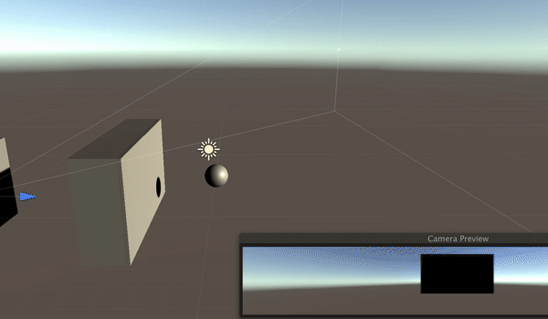
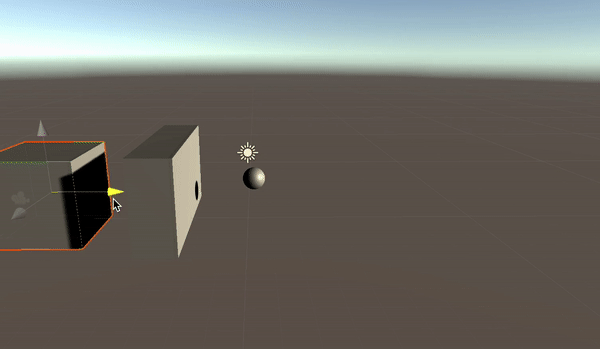
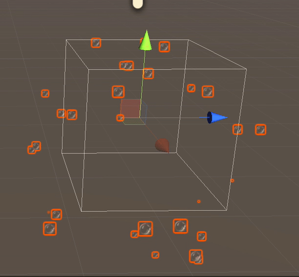
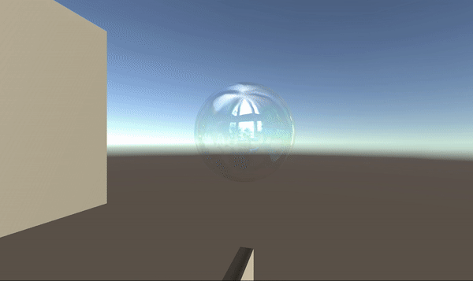

# RealisticBubblewithBurstandDeform_Unity

A simple Unity Project file creating bubble with deformations/force.

Process>> 

creating a bubbly surface using Unity's cloth component, adding some constraints to control the dislocation of the mesh and tinkering with cloth inspector values like dampness, stiffness etc to get to your desired result.

-- Creating a system so if we touch it gently it floats away, if hard it disables the render and plays a burst. 
Full Code  >>> https://github.com/saszer/RealisticBubblewithBurstandDeform_Unity/blob/master/Bubble%20Behaviour%20Unity%20Proj%20File/Assets/Scripts/dieandplayparticles.cs

just a touch -

hard hit -

creating the burst particle system :  

Shading the bubble : 
(shader from https://github.com/JPBotelho/Soap-Bubble)

// Created while development of Multiverse (https://www.blurb.com/b/9703113-art-of-multiverse) a Mixed Reality experience using LeapMotion and AR Depth Camera's mounted with HTC Vive. 

https://vimeo.com/356139571 < this stage || full > https://vimeo.com/369004134
